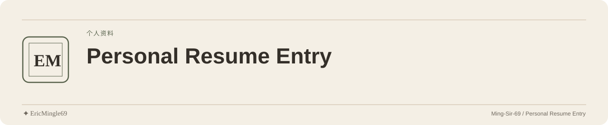

<picture>
  <source media="(prefers-color-scheme: dark)" srcset="readme-assets/header-dark.svg">
  <source media="(prefers-color-scheme: light)" srcset="readme-assets/header-light.svg">
  
</picture>

  <a href="README.md">简体中文</a> · <a href="README.en.md">English</a> · <a href="PERSONAL-NOTICE.md">✦ EricMingle69</a>

# Personal Resume Entry

## Purpose

A repository reserved for Ming-Sir-69’s personal resume material, currently containing a repository description rather than a resume file or website source.

## Repository guide

| Entry | Contents |
| --- | --- |
| [Repository description](README.md) | Current reading entry |

## Getting started

1. Read this page to understand the currently available material.
2. The repository does not provide a PDF/Word resume or a separate resume website link.
3. Cloning or downloading obtains repository documentation, not a resume that has not been committed.

## Scope and limitations

- No application source, build process or verified deployment entry is provided.
- Education, work history, skills and contact details are outside the material currently supplied here.
- The public resume version, file entry and update notes can be established once an actual file is added.

## Sources and existing licenses

The original description is “Ming_Sir_69’s personal resume”. The original repository has no LICENSE/NOTICE; rights for personal resume content and redistribution have not been declared.

---

Documentation maintained by **✦ EricMingle69** · [Ming-Sir-69](https://github.com/Ming-Sir-69)  
[Personal identity, licensing and permissions](PERSONAL-NOTICE.md) · The header follows your GitHub theme.
